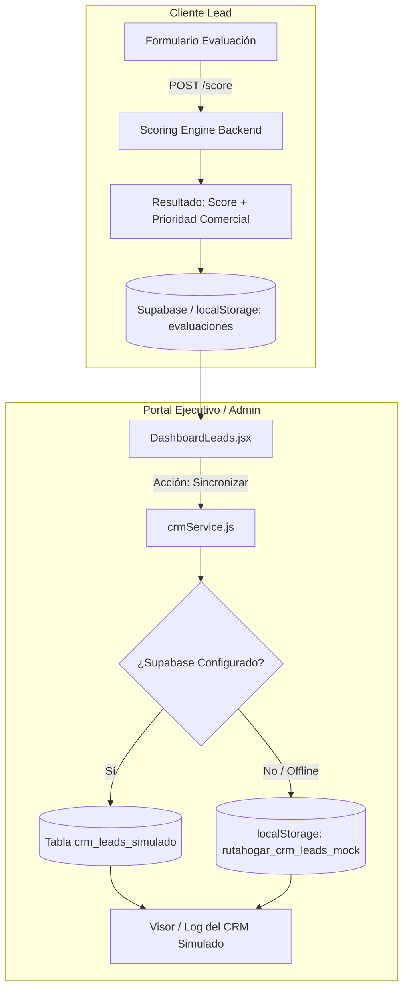

# Antigravity — Guía de Ejecución: HU 12 (Sistema de Derivación e Integración Comercial)

> **Sprint vigente:** Sprint 2  
> **Historia:** HU 12 — Sistema de Derivación e Integración Comercial  
> **Estimación:** 8 SP (según `docs/BACKLOG_HUS_RUTAHOGAR.md`) / 5 SP (según ficha histórica en wiki)  
> **Actor:** Ejecutivo comercial · Administrador inmobiliario  
> **Estado:** 🗓 Planificada para este Sprint  
> **Metodología:** Scrum + SDD Acotado (`docs/SCRUM_SDD_ACOTADO_RUTAHOGAR.md`)  
> **Target Agent:** Google Antigravity

---

## 1. Propósito y Contexto para Antigravity

Este archivo proporciona la guía técnica, operativa y metodológica adaptada al flujo de trabajo del agente **Google Antigravity** para abordar la **HU 12** durante el Sprint actual.

RutaHogar es una plataforma profesional de precalificación y orientación financiera e inmobiliaria. En este sprint se requiere implementar la **derivación de leads evaluados hacia un CRM simulado**, permitiendo al equipo comercial inmobiliario gestionar leads, priorizar la atención y mantener actualizada la información cuando cambian los antecedentes del lead.

> [!IMPORTANT]
> **Integración con CRM Simulado (No producción real):**  
> La HU 12 exige derivación hacia un **CRM simulado** (mock service / persistencia local o tabla Supabase dedicada / API simulada). La integración con CRMs externos de producción (HubSpot, Salesforce, etc.) corresponde al alcance de investigación del **Spike 2** y no debe implementarse sin definición previa de APIs externas.

---

## 2. Protocolo de Operación Antigravity

Cuando Antigravity tome este sprint o tareas relacionadas con HU 12, debe seguir estrictamente este flujo:

### Fase 1: Research & Context Gathering
- Usar `view_file` para inspeccionar `frontend/src/components/DashboardLeads.jsx`, `frontend/src/services/projectService.js`, `backend/app/scoring_engine/commercial_priority.py` y `docs/crm-integration.md`.
- No alterar código fuente ni ejecutar comandos destructivos durante esta fase.

### Fase 2: Implementation Plan (Planning Mode)
- Al iniciar la implementación, Antigravity debe operar en **Planning Mode** creando el artefacto:  
  `implementation_plan.md` (con `UserFacing: true`, `RequestFeedback: true`).
- Incluir la arquitectura de simulación, contrato del payload, componentes a modificar y plan de verificación.
- **Detenerse y solicitar aprobación del usuario** antes de escribir código funcional.

### Fase 3: Ejecución Quirúrgica
- Modificar archivos usando `replace_file_content` (preservando comentarios existentes y estilos) o `write_to_file` para módulos nuevos.
- Comandos en Windows PowerShell:
  ```powershell
  # Frontend dev / test / lint
  cd frontend; npm run test
  cd frontend; npm run build

  # Backend (si aplica servicio mock o tests de contrato)
  cd backend; .venv\Scripts\python -m pytest tests\ -q
  ```
- No ejecutar comandos `cd` aislados; usar siempre el parámetro `Cwd` de la herramienta `run_command`.

### Fase 4: Verificación & Walkthrough
- Crear o actualizar el artefacto `walkthrough.md` documentando:
  - Cambios realizados.
  - Evidencias de sincronización hacia el CRM simulado.
  - Pruebas automatizadas y verificación manual.

---

## 3. Especificación de la Historia de Usuario (HU 12)

### Enunciado
> **Como** ejecutivo/Administrador inmobiliario,  
> **quiero** mandar en un CRM simulado los leads evaluados junto con su información relevante y sus niveles de prioridad,  
> **para** gestionarlos dentro del flujo comercial y saber cuáles requieren mayor atención.

### Criterios de Aceptación (Gherkin BDD)

#### E1 — Derivación de leads evaluados
- **Dado** que un usuario completó su evaluación y obtuvo un score,
- **cuando** corresponda ejecutar la sincronización con el CRM (manual por el ejecutivo o automática post-evaluación),
- **entonces** el sistema debe enviar al CRM simulado la información relevante del lead, **independientemente de su clasificación** (`Alto`, `Medio`, `Bajo` o `Requiere antecedentes`).

#### E2 — Información del lead y proyecto objetivo
- **Dado** que un lead será enviado al CRM simulado,
- **cuando** se construya el payload de integración,
- **entonces** se deben incluir:
  1. Datos de contacto y perfil comercial necesarios (nombre, correo, teléfono si fue provisto, consentimientos).
  2. Proyecto inmobiliario objetivo seleccionado o asignado.
  3. Resultados de su evaluación asociados a dicho proyecto (score, clasificación, capacidad de pago, brecha o ahorro requerido).

#### E3 — Priorización del lead (Métricas separadas)
- **Dado** que un lead posee una evaluación general y un proyecto objetivo,
- **cuando** sea enviado al CRM simulado,
- **entonces** deben registrarse y presentarse de manera **separada**:
  1. **Prioridad general** (`commercial_priority`: nivel de acción, motivo y sugerencia de contacto emitida por `scoring_engine/commercial_priority.py`).
  2. **Compatibilidad por capacidad de compra** con el proyecto objetivo (si el dividendo y pie cubren el valor de la vivienda según reglas financieras).
  3. **Compatibilidad por afinidad** con el proyecto objetivo (puntaje o coincidencia en comuna, tipología o preferencias declaradas).

#### E4 — Actualización periódica en el CRM
- **Dado** que un lead ya existe en el CRM simulado,
- **cuando** cambie su score, proyecto objetivo, compatibilidad por capacidad de compra, compatibilidad por afinidad o información comercial relevante,
- **entonces** en la siguiente sincronización el sistema debe **actualizar el registro existente** en el CRM simulado (sin duplicar entradas y registrando la fecha/hora de actualización y hash de versión).

---

## 4. Ficha Técnica SDD Acotada para HU 12

Siguiendo `docs/SCRUM_SDD_ACOTADO_RUTAHOGAR.md`, antes de implementar se establece la siguiente ficha:

| Dimensión | Definición para HU 12 |
| :--- | :--- |
| **¿Qué problema resuelve?** | Permite al equipo comercial recibir y auditar leads calificados en un repositorio tipo CRM sin depender de una integración externa real aún no contratada. |
| **Actor beneficiado** | Ejecutivo comercial e Inmobiliaria (vista de gestión y priorización de cartera). |
| **Reglas afectadas** | Capa de prioridad comercial (`backend/app/scoring_engine/commercial_priority.py`), servicios de leads en frontend (`projectService.js` / `crmService.js`), estados de sincronización. |
| **Datos sensibles involucrados** | Información financiera del lead (ingresos, deuda, score). Requiere verificación estricta de `consentimiento == true`. **El lead no debe ver notas ni estados de derivación interna**. |
| **Cambios de integración** | Creación del adaptador y almacenamiento del CRM simulado (`crmService.js`, con soporte dual Supabase/localStorage). |
| **Fuera de alcance** | Conexión HTTP contra APIs reales de terceros (HubSpot, Salesforce, etc.) — reservado a Spike 2. Envío de leads sin consentimiento. Modificación de la fórmula del score base. |
| **Pruebas y verificación** | Pruebas unitarias de payload en Vitest/Jest, pruebas de idempotencia en actualización (E4), verificación visual en el panel del ejecutivo. |

---

## 5. Diseño Arquitectónico para Antigravity



### 5.1. Contrato del Payload de Integración al CRM Simulado

El payload debe ser estructurado y tipado (TypeScript/JSDoc o Pydantic):

```json
{
  "lead_id": "usr_9b1deb4d-3b7d-4bad-9bdd-2b0d7b3dcb6d",
  "lead_info": {
    "nombre": "Juan Pérez",
    "email": "juan.perez@example.cl",
    "telefono": "+56912345678",
    "fecha_evaluacion": "2026-09-20T14:30:00Z",
    "consentimiento": true
  },
  "evaluacion_general": {
    "score": 78.5,
    "clasificacion": "Alto",
    "scoring_version": "1.1.0"
  },
  "priorizacion_comercial": {
    "prioridad_general": "contact_now",
    "nivel_accion": "Contactar de inmediato",
    "motivo": "Lead con alta preparación financiera y compatible con el objetivo inmobiliario.",
    "send_to_crm": true
  },
  "proyecto_objetivo": {
    "proyecto_id": "prj_e4a123",
    "proyecto_nombre": "Edificio Mirador Ñuñoa",
    "inmobiliaria_id": "inm_abc789",
    "compatibilidad_capacidad": {
      "estado": "compatible",
      "dividendo_estimado_uf": 22.4,
      "pie_requerido_uf": 600,
      "pie_disponible_uf": 650,
      "brecha_uf": 0
    },
    "compatibilidad_afinidad": {
      "puntaje_afinidad": 90,
      "nivel": "Alta afinidad",
      "coincidencia_comuna": true,
      "coincidencia_tipologia": true
    }
  },
  "sincronizacion": {
    "crm_sync_id": "sync_550e8400-e29b-41d4-a716-446655440000",
    "version_hash": "a1b2c3d4e5f6...",
    "estado_sync": "sincronizado",
    "sincronizado_el": "2026-09-20T15:00:00Z",
    "actualizado_el": "2026-09-20T15:00:00Z"
  }
}
```

### 5.2. Capa de Servicio: `frontend/src/services/crmService.js`

Antigravity debe crear o estructurar un servicio desacoplado que respete el patrón del proyecto:

```javascript
// Funciones mínimas a proveer:
export async function syncLeadToSimulatedCrm(leadEvaluationData) { ... }
export async function getSimulatedCrmLeads(filterOptions = {}) { ... }
export async function getSimulatedCrmLeadById(leadId) { ... }
export async function bulkSyncEvaluatedLeads(leadsList) { ... }
```

**Reglas de actualización (Criterio E4):**
- Cada registro en el CRM simulado debe calcular un hash o firma (`version_hash`) con los campos clave (`score`, `proyecto_id`, `compatibilidad_capacidad`, `compatibilidad_afinidad`, `contacto`).
- Al sincronizar:
  - Si el `lead_id` no existe en el CRM simulado: **crear registro nuevo**.
  - Si el `lead_id` ya existe y el hash cambió: **actualizar campos**, refrescar `actualizado_el` y registrar hito en el historial de sync.
  - Si el hash no cambió: retornar status `sin_cambios` evitando escrituras innecesarias.

### 5.3. Interfaz de Usuario (UI) en Dashboard Ejecutivo

En `frontend/src/components/DashboardLeads.jsx` (o vista modular dedicada de CRM):
1. **Indicador de Estado CRM**:
   - Badge visual en la lista de leads: `Pendiente de Sync`, `En CRM Simulado`, `Requiere Actualización`.
2. **Acción de Derivación**:
   - Botón individual: "Derivar a CRM Simulado".
   - Botón masivo: "Sincronizar Leads Evaluados con CRM".
3. **Pestaña / Modal de Auditoría del CRM Simulado**:
   - Permite al evaluador universitario o ejecutivo revisar qué registros existen en el CRM simulado, confirmando que la derivación opera con éxito.
4. **Separación de roles**:
   - Este componente o sección debe ser **completamente invisible** para usuarios con rol `lead` (comprador).

---

## 6. Guardrails Inviolables

> [!CAUTION]
> **No romper ni alterar:**
> - El contrato ni el payload de `POST /score` en `backend/app/main.py`.
> - La lógica de cálculo ni los pesos ponderados en `backend/app/scoring_engine/`.
> - La disponibilidad offline/local: si Supabase no está activo, la derivación debe persistir de forma transparente en `localStorage`.

1. **RutaHogar como Marca Única**: No introducir el término `ScoreLeads` en textos, componentes o interfaces creadas.
2. **Consentimiento Obligatorio**: Nunca sincronizar un lead cuyo consentimiento de tratamiento de datos sea falso o no esté registrado.
3. **Métricas Separadas (E3)**: En el CRM simulado, no fundir la prioridad general con la afinidad ni con la capacidad de compra. Deben ser 3 objetos o columnas diferenciadas.
4. **Naturaleza Referencial**: Toda visualización comercial debe mantener el disclaimer: *"Orientación referencial para gestión comercial. No constituye aprobación crediticia."*

---

## 7. Plan de Trabajo Paso a Paso para el Sprint

Antigravity debe ejecutar la HU 12 siguiendo este checklist ordenado:

- [ ] **Paso 1: Especificación del Contrato & Servicio Mock**
  - Crear `frontend/src/services/crmService.js` con soporte dual (`localStorage` / Supabase).
  - Implementar hashing o control de versiones para cumplir **E4** (actualizaciones sin duplicidad).
- [ ] **Paso 2: Generador de Payload de Derivación**
  - Construir función transformadora que mapee la evaluación del lead a los 3 bloques exigidos por **E2** y **E3** (Prioridad comercial, Capacidad de compra, Afinidad).
- [ ] **Paso 3: Integración en Dashboard Ejecutivo**
  - Añadir en `DashboardLeads.jsx` las acciones de derivación (individual y masiva) y badges de estado.
  - Implementar la vista/drawer de auditoría del "CRM Simulado" para inspeccionar los leads sincronizados.
- [ ] **Paso 4: Pruebas Automatizadas**
  - Añadir tests unitarios frontend (Vitest) para `crmService.js` validando derivación (E1, E2, E3) y actualización por cambio de datos (E4).
  - Validar compatibilidad con el backend existente ejecutando pytest.
- [ ] **Paso 5: Verificación & Documentación de Entrega**
  - Validar build limpio (`npm run build`).
  - Generar el artefacto `walkthrough.md` con captura de flujo o logs de verificación para el Sprint Review.
