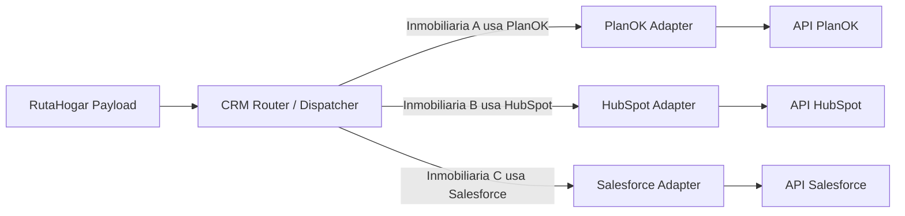

# Mapeo de Integración CRM - Mercado Inmobiliario Chileno

Al vincular RutaHogar con múltiples inmobiliarias, debemos soportar los distintos sistemas de gestión (CRM) que estas utilizan. Actualmente, nuestro *payload* es agnóstico (modelo propio de RutaHogar), pero para integraciones reales necesitaremos construir **Adaptadores (Adapters)** para traducir nuestro modelo al esquema de cada proveedor.

A continuación, se analizan los 3 CRMs más relevantes en la industria inmobiliaria chilena, sus requerimientos y las brechas actuales en nuestro modelo de datos.

---

## 1. PlanOK
Es el software de gestión comercial e inmobiliaria por excelencia en Chile, utilizado por gran parte de las inmobiliarias para gestionar sus salas de ventas, cotizaciones y promesas.

### Mapeo de atributos
| Atributo RutaHogar | Campo en PlanOK (API Leads) | Estado / Brecha |
| :--- | :--- | :--- |
| `lead_info.nombre` | `nombres`, `apellidos` | **Brecha:** RutaHogar captura un `full_name`. PlanOK exige separar nombre y apellido. |
| **(No capturado)** | `rut` | **Faltante Crítico:** PlanOK utiliza el RUT como llave primaria para de-duplicar leads en las salas de ventas. RutaHogar debe solicitar el RUT o enviarlo como `11111111-1` (genérico) perdiendo trazabilidad. |
| `lead_info.email` | `email` | Soportado. |
| `lead_info.telefono` | `telefono` | Soportado (PlanOK exige prefijo +56). |
| `proyecto_objetivo.proyecto_id`| `id_proyecto` | **Requerido:** Requiere mapear el ID interno de RutaHogar con el ID de proyecto asignado dentro de PlanOK. |
| (Datos financieros y Score) | `comentarios` (Texto libre) | **Faltante de estructura:** PlanOK no posee campos nativos para "Pie Disponible" o "Score Financiero". Toda nuestra analítica (`evaluacion_general`, `priorizacion_comercial`) deberá concatenarse en el campo de texto libre `comentarios` o `observaciones` para que el ejecutivo lo lea. |

---

## 2. HubSpot
Muy utilizado por inmobiliarias medianas y modernas, y agencias de marketing inmobiliario por sus capacidades de automatización (*inbound marketing*).

### Mapeo de atributos
| Atributo RutaHogar | Campo en HubSpot (Contacts) | Estado / Brecha |
| :--- | :--- | :--- |
| `lead_info.email` | `email` | Soportado. Es la llave primaria en HubSpot. |
| `lead_info.nombre` | `firstname`, `lastname` | **Brecha:** Al igual que PlanOK, conviene separar nombres. |
| `proyecto_objetivo.proyecto_nombre` | `proyecto_interes` (Custom) | **Requiere Custom Property:** La inmobiliaria debe crear la propiedad en su HubSpot. |
| `evaluacion_general.score` | `rutahogar_score` (Custom) | **Requiere Custom Property:** Debe crearse el campo en HubSpot para permitir automatizaciones (ej: enviar mail si score > 700). |
| `priorizacion_comercial.nivel_accion` | `lead_status` | **Brecha de Mapeo:** Nuestro estado ("Contactar Rápido") debe homologarse a los *Lead Status* de la inmobiliaria (ej: `NEW`, `OPEN`). |

---

## 3. Salesforce (Sales Cloud)
Utilizado por las inmobiliarias más grandes y corporativas de Chile.

### Mapeo de atributos
| Atributo RutaHogar | Campo en Salesforce (Lead Object) | Estado / Brecha |
| :--- | :--- | :--- |
| `lead_info.nombre` | `LastName` | **Faltante Crítico:** Salesforce exige `LastName` (Apellido) de forma obligatoria. `FirstName` es opcional. |
| **(No aplica)** | `Company` | **Brecha:** Es obligatorio en Salesforce estándar, suele enviarse "Particular" o el nombre de la inmobiliaria para leads B2C. |
| `lead_info.email` | `Email` | Soportado. |
| (Score y Finanzas) | Campos `__c` (Custom Fields) | Soportado mediante configuración. La inmobiliaria debe crear campos como `Pie_Disponible__c`. |

---

## Patrón de Arquitectura Sugerido (Patrón Adapter)

Para soportar esto sin ensuciar la lógica de negocio, se debe implementar el **Patrón Adapter** en el backend. 

## Resumen de atributos faltantes a agregar en RutaHogar
Si queremos integrarnos robustamente, deberíamos considerar capturar o derivar:
1. **RUT (o DNI):** Crítico para integraciones bancarias y con PlanOK en Chile.
2. **Nombre y Apellido separados:** En lugar de un solo campo `full_name`.
3. **Mapeo de IDs de Proyectos Externos:** Una tabla en la base de datos que vincule `rutahogar_project_id` con `planok_project_id` o `salesforce_campaign_id`.
