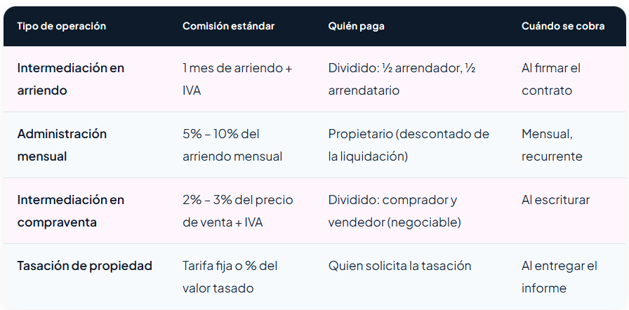

# Spike 2 · E6 — Investigación del ecosistema de corredores inmobiliarios

**Proyecto:** RutaHogar<br>
**Autor(es):** Rodrigo Ignacio Ramírez Díaz<br>  
**Fecha de consulta y consolidación:** 20-09-2026<br>  
**Estado:** Investigación documental terminada; recomendaciones pendientes de priorización por el equipo.<br>
**Relacionado con:** Spike 2 (Validación técnica de privacidad, roles, trazabilidad, datos e integraciones externas) — Criterio E6.<br>  
**Precedentes metodológicos:** [Scrum + SDD acotado](../SCRUM_SDD_ACOTADO_RUTAHOGAR.md), [Spike 2 · E4 (Fuentes de datos externas)](spike2-e4-external-data-sources.md), [Spike 1 · E4 (Criterios de matching)](spike1-e4-lead-project-matching-criteria.md).

---

## 1. Objetivo y Alcance

### 1.1 Objetivo del Criterio E6
Documentar el criterio solicitado en el marco del **Spike 2**:

> **Dado** que los corredores de propiedades participan en la captación, orientación y derivación de potenciales compradores, **cuando** el equipo investigue cómo funciona este actor dentro del mercado inmobiliario, **entonces** debe documentar sus principales procesos de trabajo, modelo de negocio, relación con inmobiliarias y compradores, herramientas utilizadas, manejo y calificación de leads, información que requieren para gestionar clientes y posibles oportunidades de integración con la plataforma.

### 1.2 Habilitación y Decisiones
Este criterio investigativo prepara y habilita:
- La **decisión formal sobre el modelado del actor "Corredor de Propiedades"** dentro de la matriz de roles y permisos del sistema (`Actores`).
- El análisis de su eventual impacto sobre la **HU 7** (Gestión del catálogo de proyectos inmobiliarios) y la **HU 12** (Sistema de derivación e integración comercial).

### 1.3 Nivel de Evidencia y Límites de Alcance
- **Ámbito:** Corretaje inmobiliario habitacional en Chile (compraventa y arriendo de propiedades nuevas y usadas).
- **Fuentes consultadas:** Publicaciones de la industria inmobiliaria chilena, guías operativas de corretaje (PopEstate, Corredores Integrados, Aqueveque), portales de comercialización y plataformas CRM especializadas.
- **Fuera de alcance:** Este documento no implementa pantallas, endpoints, tablas ni migraciones. No modifica las reglas vigentes de scoring ni altera los contratos activos del sistema.

---

## 2. Procesos de Trabajo y Modelo de Negocio

El corredor de propiedades en Chile opera como un intermediario mercantil y asesor técnico entre las partes de una transacción inmobiliaria (comprador-vendedor o arrendatario-arrendador).

### 2.1 Proceso de Captación

```
Captación de Oferta (Inventario)       Captación de Demanda (Cotizantes)
  - Prospección directa / zonificación   - Portales (Portalinmobiliario, TocToc)
  - Convenios con inmobiliarias          - Pauta digital (Meta / Google Ads)
  - Órdenes de venta / arriendo          - WhatsApp Business / Referidos
                     \                   /
                      \                 /
                       ▼               ▼
                 Publicación Multicanal vía CRM
             (KiteProp, AlterEstate, Impulsa, Codelan)
```

1. **Captación de Inventario (Propiedades):**
   - **Prospección y Cartera:** El corredor capta propietarios mediante prospección directa en zonas de interés, referidos de clientes antiguos y convenios comerciales con empresas inmobiliarias para comercializar stock nuevo.
   - **Formalización Legal:** Se suscribe una **Orden de Venta o Arriendo**, la cual puede ser:
     - *Exclusiva:* Otorga exclusividad comercial a la corredora durante un plazo determinado (usualmente 60 a 120 días).
     - *Abierta / Simple:* El propietario autoriza a múltiples corredores o publicita por cuenta propia; la comisión se liquida a quien cierre la operación.

2. **Captación de Demanda (Compradores / Cotizantes):**
   - **Portales Inmobiliarios:** Difusión a través de las principales plataformas del mercado chileno (*Portalinmobiliario.com / Mercado Libre, TocToc, Portal de Corredores, Icasas*).
   - **Publicidad Digital:** Campañas geolocalizadas en Meta Ads (Instagram/Facebook) y Google Ads orientadas a personas en búsqueda activa de vivienda.
   - **Canales Directos:** Mensajería instantánea por WhatsApp Business y bases de datos propias de clientes precalificados.

3. **Centralización y Sincronización:**
   - Para no duplicar la carga manual de propiedades, las corredoras medianas y consolidadas emplean herramientas CRM especializadas (*KiteProp, AlterEstate, Impulsa, Codelan, Orkezto*) que publican y sincronizan automáticamente las fichas de las propiedades en múltiples portales inmobiliarios a la vez.

---

### 2.2 Modelo de Negocio y Estructura de Comisiones (Pricing)

El modelo de ingresos se sustenta en honorarios por intermediación pactados sobre el valor de la transacción, más servicios profesionales complementarios.

#### Tabla Estándar de Comisiones en Chile



*Fuente de referencia:* [PopEstate — Corretaje inmobiliario en Chile: comisiones, modelo de negocio y regulación](https://www.popestate.com/corretaje-inmobiliario-en-chile).

A partir de la evidencia gráfica y la práctica consolidada del mercado chileno, la estructura de cobros se desglosa en la siguiente matriz operativa:

| Tipo de operación | Comisión estándar de mercado | Sujeto obligado (Quién paga) | Hito de cobro (Cuándo se cobra) |
| :--- | :--- | :--- | :--- |
| **Intermediación en compraventa** | **2% – 3%** del precio final de venta (+ IVA) | Dividido entre **comprador** y **vendedor** (lo estándar habitual en Chile es 2% vendedor y 2% comprador = **4% total**) | **Al escriturar** (en la suscripción de la escritura pública definitiva ante notario) |
| **Intermediación en arriendo** | **1 mes de arriendo** (+ IVA) | Dividido en **½ arrendador** (50%) y **½ arrendatario** (50%) | **Al firmar el contrato** de arriendo |
| **Administración mensual de arriendos** | **5% – 10%** del canon de arriendo mensual | **Propietario** (descontado directamente de la liquidación mensual de rentas) | **Mensual, recurrente** |
| **Tasación de propiedad** | Tarifa fija (generalmente entre 2 y 5 UF) o porcentaje del valor tasado | Quien solicita formalmente el informe de tasación | **Al entregar el informe** pericial |

#### Modalidades Adicionales de Ingresos
- **Canje Inmobiliario (Modelo Colaborativo):** Práctica habitual en redes y asociaciones gremiales (*Corredores Integrados, ACOP, Coproch, eXp Realty*), donde la comisión total (4%) se reparte en un **50/50** entre el corredor que tiene la propiedad captada en exclusiva y el corredor externo que aporta al comprador final evaluado y calificado.
- **Servicios Profesionales Anexos:** Honorarios cobrados por encargo de estudios de títulos legales, obtención de certificados de dominio vigente en el Conservador de Bienes Raíces (CBR), redacción de promesas de compraventa y asesoría en la tramitación bancaria del crédito hipotecario.

---

### 2.3 Ciclo de Vida del Cliente con el Corredor

```
1. Entrada y Registro  ──►  2. Calificación Financiera  ──►  3. Muestra de Propiedades
   (Portales / WhatsApp)       (Renta vs. Dividendo / Pie)      (Filtro de Cartera)
                                                                       │
                                                                       ▼
5. Escrituración y Entrega ◄── 4. Negociación y Promesa ◄──────────────┘
   (Bancos / Notaría / CBR)     (Firma Promesa / Resguardo Pie)
```

1. **Entrada y Registro del Lead (Atención Temprana):** Recepción de consultas desde portales, redes o teléfono. El tiempo de respuesta es un factor crítico de conversión: prospectos atendidos en menos de 15 minutos tienen una probabilidad significativamente mayor de concretar una visita.
2. **Calificación Financiera y Diagnóstico Inicial:** Evaluación preliminar del presupuesto del cotizante, nivel de ingresos, ahorro disponible para el pie y factibilidad hipotecaria.  
   > *Punto de fricción:* Actualmente la mayoría de los corredores realiza este paso a ciegas o mediante preguntas informales, lo que ocasiona pérdidas sustanciales de tiempo comercial coordinando visitas con cotizantes que luego no califican financieramente.
3. **Muestra de Propiedades y Asesoría:** Coordinación y ejecución de visitas técnicas (presenciales o virtuales), entrega de fichas de proyecto y asesoramiento sobre el entorno urbano y conectividad.
4. **Negociación y Promesa de Compraventa:** Presentación de la oferta formal al vendedor, recolección de antecedentes legales iniciales y firma de la Promesa de Compraventa (con entrega de cheque de resguardo o garantía por el pie).
5. **Tramitación Hipotecaria, Escrituración y Postventa:** Seguimiento de la aprobación final del banco y tasación hipotecaria, coordinación del estudio de títulos, firma de la escritura de compraventa ante notario, inscripción en el Conservador de Bienes Raíces (CBR), entrega física del inmueble y liquidación formal de las comisiones.

---

## 3. Relación con Inmobiliarias y Compradores

### 3.1 Interacción con la Inmobiliaria (B2B)

Las inmobiliarias recurren al corretaje externo principalmente para complementar su fuerza de venta interna, acelerar la colocación de stock remanente (entrega inmediata) o comercializar proyectos en etapas tempranas (verde o blanco).

- **Mecanismos de Derivación y Presentación de Leads:**
  - *Inyección vía CRM:* Corredoras consolidadas transfieren prospectos hacia los sistemas comerciales de la inmobiliaria (*Impulsa, AlterEstate, KiteProp*) mediante integraciones API o formularios compartidos.
  - *Ficha Comercial / Dossier:* El corredor elabora un resumen con los datos de contacto, la tipología de interés, la simulación preliminar de dividendo y el estado de la preaprobación bancaria.
- **Convenios Comerciales y Comisiones:**
  - *Orden de Venta Abierta (Corretaje Externo):* La inmobiliaria permite a múltiples corredores ofrecer el proyecto; si el corredor presenta al cliente y este suscribe promesa de compraventa, la inmobiliaria paga una comisión acordada (típicamente entre el 1.5% y el 2.5% del valor neto de la unidad vendida).
  - *Venta Exclusiva o Master Broker:* Para proyectos medianos o loteos, la inmobiliaria externaliza toda la gestión de ventas a una sola agencia de corretaje, acordando metas y presupuestos de marketing.

### 3.2 Interacción con el Comprador (B2C)

El comprador ve al corredor como un facilitador que le muestra alternativas, pero espera de él orientación sobre si realmente podrá comprar la propiedad.

- **Nivel de Asesoría Financiera Brindada:**
  - *Regla General de Capacidad de Pago:* Los corredores aplican la regla bancaria tradicional: el dividendo hipotecario mensual estimado no debe superar el **25% a 30%** de los ingresos líquidos demostrables (regla de renta 4 veces el dividendo).
  - *Disponibilidad de Pie:* Verifican si el comprador cuenta con el 10% o 20% del valor total de la propiedad para el pie, o si requiere facilidades de pago en cuotas durante la construcción en verde.
  - *Orientación en Subsidios Estatales:* Asesoría básica respecto a subsidios MINVU (DS1 Tramo 1, 2 y 3; DS19 de integración) y uso de la garantía estatal FOGAES (financiamiento de hasta el 90% con 10% de pie).
- **Principal Punto de Dolor en la Interacción:**
  - La evaluación financiera que hace el corredor es eminentemente manual, basada en la buena fe del cliente. Carece de herramientas digitales de precalificación inmediata y explicable, provocando que más del 60% de los compradores interesados terminen con solicitudes de crédito rechazadas por las entidades financieras.

---

## 4. Herramientas, Stack Tecnológico y Manejo de Leads

### 4.1 Herramientas Utilizadas

| Categoría | Plataformas observadas en el mercado | Uso principal |
| :--- | :--- | :--- |
| **Portales inmobiliarios** | Portalinmobiliario (Mercado Libre), TocToc, Portal de Corredores, Icasas | Publicación masiva de cartera y captación inicial de cotizantes. |
| **CRM especializado de corretaje** | KiteProp, AlterEstate, Impulsa CRM, Orkezto, Codelan, EasyBroker | Gestión centralizada de fichas, sincronización multi-portal, embudos de venta y agenda de visitas. |
| **Canales de comunicación directa** | WhatsApp Business, Meta Business Suite, llamadas telefónicas | Contacto inmediato con el interesado y envío rápido de fotografías/fichas. |
| **Herramientas manuales** | Microsoft Excel, Google Sheets, notas de escritorio | Control informal en agencias pequeñas o corredores independientes; genera pérdida de trazabilidad y fugas de leads. |

### 4.2 Proceso de Manejo y Calificación de Leads

1. **Triaje Inicial por Interés y Factibilidad:**
   - Contacto rápido para verificar el interés genuino en la propiedad, disponibilidad de visita y plazo proyectado de compra (inmediato, 3 meses, 6 meses).
2. **Segmentación de Prospectos:**
   - *Lead Calificado (Prioridad Alta):* Posee preaprobación bancaria o mutuaria vigente, o cuenta con fondos comprobables para el pie y una relación dividendo/ingreso holgada.
   - *Lead en Observación / Potencial (Prioridad Media):* Cumple con la estabilidad laboral y la renta requerida, pero le falta completar el pie (candidato a FOGAES o subsidio DS1) o requiere complementación de ingresos con un co-deudor.
   - *Lead Inviable / No Apto (Prioridad Baja):* Registra morosidades financieras severas vigentes (boletín comercial / CMF), presenta sobreendeudamiento crítico o carece de fondos para el pie mínimo.

### 4.3 Información y Antecedentes Requeridos para Gestión

Para formalizar la postulación a créditos y compraventas, el corredor solicita la siguiente carpeta de antecedentes al comprador:

- **Ingresos y Estabilidad Laboral:**
  - *Dependientes:* Últimas 3 a 6 liquidaciones de sueldo, certificado de cotizaciones previsionales AFP (con RUT empleador de los últimos 12 meses) y certificado de antigüedad laboral emitida por el empleador.
  - *Independientes / Honorarios:* Carpeta tributaria electrónica emitida por el SII (Formulario 22 de los últimos 2 años) y resumen de boletas de honorarios emitidas en los últimos 12 a 24 meses.
- **Solvencia Financiera y Deuda:**
  - Informe de Deudas de la Comisión para el Mercado Financiero (CMF, obtenido gratuitamente mediante ClaveÚnica).
  - Certificado de Informes Comerciales (Dicom / Equifax Platinum 360).
- **Disponibilidad de Fondos para el Pie:**
  - Cartolas de cuentas de ahorro para la vivienda, fondos mutuos, depósitos a plazo o saldos en cuentas bancarias.
- **Identificación y Complementación de Renta:**
  - Cédula de identidad vigente por ambos lados.
  - Documentación laboral y financiera homóloga del co-deudor o aval en caso de complementar renta (cónyuge, conviviente civil o familiar directo).

---

## 5. Oportunidades de Integración con RutaHogar

El análisis del flujo operativo de los corredores de propiedades revela oportunidades claras de sinergia con el valor que ofrece RutaHogar:

```
                            ┌────────────────────────────────────────┐
                            │          Plataforma RutaHogar          │
                            └───────────────────┬────────────────────┘
                                                │
                 ┌──────────────────────────────┼──────────────────────────────┐
                 ▼                              ▼                              ▼
    [Oportunidad 1: Precalificador]  [Oportunidad 2: Reciclaje]   [Oportunidad 3: Dossier]
    Filtro ágil previo a visitas      Derivación de leads no       Exportación estandarizada
    sin requerir papeleo previo       aptos a vivienda usada       para trámite bancario (HU25)
```

### 5.1 Oportunidad 1: Precalificador y Filtro Financiero "Sin Papeleo"
- **Propuesta de Valor:** El corredor puede enviar un enlace personalizado de RutaHogar al cotizante antes de agendar visitas a inmuebles.
- **Impacto:** El cotizante obtiene su score financiero y recomendaciones; el corredor recibe un indicador objetivo de viabilidad (`Alto`, `Medio`, `Bajo`, `Requiere antecedentes`) sin tener que pedir liquidaciones de sueldo de antemano. Esto reduce drásticamente el tiempo perdido en visitas con compradores financieramente inviables.

### 5.2 Oportunidad 2: Canal de Derivación y Reciclaje de Leads (Vivienda Usada y Subsidios)
- **Propuesta de Valor:** En el modelo actual de RutaHogar, las inmobiliarias evalúan leads orientados a proyectos nuevos. Aquellos leads que no califican por presupuesto o pie para proyectos nuevos pueden ser derivados —**con consentimiento explícito del usuario**— hacia corredores asociados que manejen vivienda usada de menor valor o proyectos con subsidios DS1/DS19.
- **Monetización y Ecosistema:** Abre la puerta a convenios de derivación comercial o canje por lead calificado, nutriendo al lead mientras avanza en su plan de mejora (`HU 13`).

### 5.3 Oportunidad 3: Exportación de Dossier Bancario Digital (`HU 25`)
- **Propuesta de Valor:** RutaHogar consolida la información financiera declarada, checklist de preparación bancaria (`HU 11`) y documentos respaldatorios cargados por el usuario. El corredor puede exportar un dossier prebancario estandarizado que agiliza la presentación de la solicitud hipotecaria ante bancos o mutuarias.

---

### 5.4 Requerimientos Técnicos, Roles y Salvaguardas

Para habilitar una futura interacción formal con corredores, el sistema debe contemplar:

1. **Definición e Incorporación del Rol `Corredor` (Spike 2 E1):**
   - Actualmente, RutaHogar define los roles: `lead`, `ejecutivo` (vinculado a una inmobiliaria), `admin_inmobiliario` y `admin_dev`.
   - Crear un rol `corredor` implicaría un actor independiente o vinculado a una agencia de corretaje, con permisos para visualizar únicamente los leads que le han sido explícitamente asignados o derivados.
   - **Salvaguarda técnica:** En la base de datos Supabase, esto exigiría políticas de **Row Level Security (RLS)** multi-tenant estrictas para garantizar el aislamiento absoluto de prospectos y propiedades entre corredores e inmobiliarias competidoras.

2. **Endpoints de API y Derivación Comercial (`HU 12`):**
   - Habilitar mecanismos seguros (vía API Keys por agencia o webhooks) para inyectar prospectos desde RutaHogar hacia los CRM más utilizados por corredores (*KiteProp, AlterEstate, Impulsa*), respetando el contrato de payload de derivación.

3. **Privacidad y Consentimiento Obligatorio (Ley 19.628 y nueva Ley 21.719):**
   - Ningún dato financiero ni de contacto de un lead puede transferirse a un corredor de propiedades sin el **consentimiento explícito, informado y previo** del usuario.
   - La derivación debe quedar registrada en la auditoría técnica del sistema, permitiendo al usuario ejercer sus derechos ARCO (acceso, rectificación, cancelación y oposición).

---

## 6. Conclusiones y Recomendaciones para el Proyecto

A partir de los hallazgos del criterio **E6**, se formulan las siguientes recomendaciones para la gestión de producto y el backlog de los Sprints:

1. **Decisión sobre Modelado de Actores (Sprint 2):**
   > [!IMPORTANT]
   > **Recomendación: No incorporar el rol `Corredor` en el Sprint 2.**  
   > Introducir un actor "Corredor" en este sprint añadiría una carga significativa de complejidad en la matriz de roles, autenticación, modelo de datos y reglas de aislamiento RLS. Se recomienda mantener el alcance del Sprint 2 enfocado estrictamente en la relación **Inmobiliaria – Ejecutivo – Lead**. La investigación del criterio E6 se da por cumplida con este documento, sirviendo de base para iteraciones posteriores.

2. **Efecto sobre HU 7 (Gestión del Catálogo de Proyectos):**
   - El catálogo de proyectos (`proyectos`, `inmobiliarias`) debe mantenerse enfocado en proyectos inmobiliarios estructurados (edificios y condominios de venta nueva).
   - No se recomienda incorporar inventario atomizado de casas o departamentos usados de corretaje dentro de la HU 7 para evitar desvirtuar el modelo de matching lead-proyecto.

3. **Efecto sobre HU 12 (Derivación Comercial / CRM):**
   - La integración con CRM simulado de la **HU 12** debe estructurarse mediante un contrato de payload desacoplado y genérico (como el propuesto en `agents/ANTIGRAVITY_HU12_DERIVACION_COMERCIAL.md` y `docs/crm-integration.md`).
   - De esta manera, el día que el equipo decida habilitar la derivación hacia corredoras de propiedades, el adaptador solo requerirá mapear los mismos campos hacia los CRMs de corretaje (*KiteProp, AlterEstate*) sin necesidad de rehacer la lógica interna de derivación.

4. **Roadmap Estratégico (Post-MVP):**
   - Registrar la oportunidad de un módulo "RutaHogar Pro para Corredores" en el backlog extendido del producto (modelo de suscripción B2B o fee por lead derivado).

---

## 7. Referencias

1. **PopEstate Chile:** *Corretaje inmobiliario en Chile: comisiones, modelo de negocio y regulación*. Disponible en: [https://www.popestate.com/corretaje-inmobiliario-en-chile](https://www.popestate.com/corretaje-inmobiliario-en-chile).
2. **TrendTIC (2026):** *Corredores inmobiliarios en jaque: el mercado exige adaptación digital y nuevas habilidades*. Disponible en: [https://www.trendtic.cl/2026/05/corredores-inmobiliarios-en-jaque/](https://www.trendtic.cl/2026/05/corredores-inmobiliarios-en-jaque/).
3. **ERP Magistra:** *CRM para inmobiliarias: funcionalidades clave para la gestión comercial en Chile*. Disponible en: [https://erpmagistra.com/blog/crm-para-inmobiliaria/](https://erpmagistra.com/blog/crm-para-inmobiliaria/).
4. **Codelan:** *Software para inmobiliarias en Chile: gestión de cartera, leads y propiedades*. Disponible en: [https://codelan.cl/blog/software-para-inmobiliarias-en-chile/](https://codelan.cl/blog/software-para-inmobiliarias-en-chile/).
5. **Aqueveque Propiedades:** *Comisiones de corredor y servicios profesionales en el mercado chileno*. Disponible en: [https://www.aquevequepro.cl/informacion/comisiones-corredor-servicios/](https://www.aquevequepro.cl/informacion/comisiones-corredor-servicios/).
6. **Catálogo Inmobiliario:** *Guía de software CRM para pequeños corredores de propiedades*. Disponible en: [https://catalogo-inmobiliario.cl/guias/crm-para-corredores-pequenos](https://catalogo-inmobiliario.cl/guias/crm-para-corredores-pequenos).
7. **Adity:** *Estrategias digitales y CRM inmobiliario para captación de clientes*. Disponible en: [https://www.adity.cl/blog/crm-inmobiliario/](https://www.adity.cl/blog/crm-inmobiliario/).
8. **Red de Corredores Integrados:** *Plataforma colaborativa y modelo de canje inmobiliario en Chile*. Disponible en: [https://www.corredoresintegrados.cl/](https://www.corredoresintegrados.cl/).
9. **Áxer Inmobiliario:** *Generación, calificación y gestión de leads para el sector inmobiliario*. Disponible en: [https://www.axer.cl/leads-para-inmobiliarias](https://www.axer.cl/leads-para-inmobiliarias).
