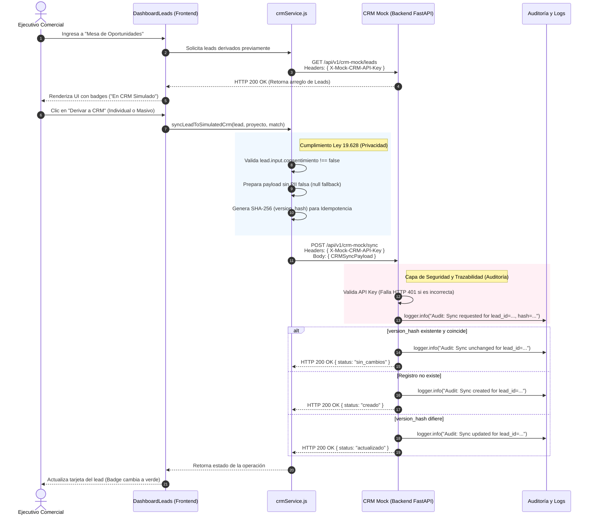

# Visualización del Flujo de Derivación Comercial (HU 12)

Este documento detalla visualmente la arquitectura de integración y el flujo completo de la Historia de Usuario 12, con un enfoque especial en la visibilidad de los métodos HTTP (GET, POST), validaciones legales y los mecanismos de auditoría (logs) implementados para asegurar la trazabilidad.

## Diagrama de Secuencia

El siguiente diagrama ilustra la interacción paso a paso entre el Ejecutivo Comercial, los servicios de Frontend y la API Mock del CRM en Backend.

---

## Puntos Críticos de Auditoría y Trazabilidad

A través del diagrama anterior, podemos evidenciar cómo el sistema maneja la seguridad y trazabilidad:

### 1. Auditoría de Eventos en Logs
Las operaciones del CRM en el backend (`crm_mock.py`) generan eventos en consola o plataforma de monitoreo. Toda petición autorizada se registra de forma unívoca, proveyendo al equipo de seguridad visibilidad total:
- **`Audit: Sync requested for lead_id=..., hash=...`**: Queda constancia del intento de derivación y el identificador de la versión de datos.
- **`Audit: Sync created/updated/unchanged for lead_id=...`**: Indica el resultado exacto de la inserción o actualización de la base de datos (in-memory o persistente).
- **`Audit: Syncing to PlanOK/HubSpot/Salesforce...`**: Queda trazabilidad explícita de qué información (Ej: `rut`, `email`) fue inyectada en endpoints simulados de proveedores externos.

### 2. Autenticación Transparente en GET y POST
La comunicación cliente-servidor obliga el uso del encabezado `X-Mock-CRM-API-Key`.
- **GET `/leads`**: Asegura que nadie pueda "raspar" (scraping) o listar los usuarios derivados.
- **POST `/sync`**: Previene la inyección de datos impidiendo que atacantes contaminen la bandeja de oportunidades.

### 3. Privacidad desde el Origen (Shift-left Privacy)
La responsabilidad de prevenir la fuga de información inicia en `crmService.js`.
- El payload no se construye ni se envía si no existe un consentimiento previo.
- Para evitar errores silenciosos o contaminación de datos con identificadores genéricos (`11111111-1`), los campos vacíos son procesados como `null` en lugar de strings de relleno (placeholders).
