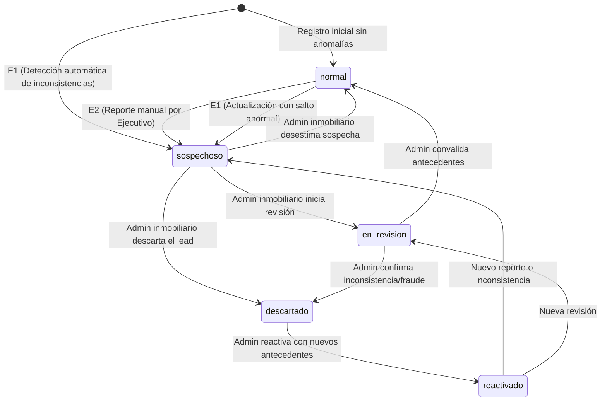

# PLAN — HU 16: Gestión de leads inconsistentes o sospechosos

- **Story:** HU16 — Gestión de leads inconsistentes o sospechosos
- **Categoría:** Deseable · **Story Points:** 8 SP
- **Actores:** Ejecutivo comercial (reporte, filtrado y priorización) & Administrador inmobiliario (revisión y resolución de estado)
- **Metodología:** Scrum + SDD acotado (`docs/SCRUM_SDD_ACOTADO_RUTAHOGAR.md`)
- **Referencia de contexto:** Spike 2 (`docs/stories/E1 Spike N2/E1 Spike 2.md` — Privacidad, RBAC y Trazabilidad Legal)
- **Estado:** 📋 Planificado (Listo para aprobación)

---

## 1. Ficha SDD Acotado

Conforme a la metodología establecida en `docs/SCRUM_SDD_ACOTADO_RUTAHOGAR.md`, se define la siguiente ficha técnica previa a la implementación:

| Pregunta | Respuesta |
| :--- | :--- |
| **¿Qué problema resuelve?** | Evita que los ejecutivos comerciales pierdan tiempo persiguiendo leads con datos financieros contradictorios, inverosímiles o manipulados, y permite que los casos sospechosos sean investigados y resueltos por el administrador sin eliminar la información histórica. |
| **Actor beneficiado** | **Ejecutivo Comercial:** prioriza leads limpios y reporta anomalías. **Administrador Inmobiliario:** gestiona la calidad de la base de datos de su tenant y supervisa casos dudosos. |
| **Reglas afectadas** | Validaciones de coherencia financiera/personal (ingreso vs. deuda, ahorro desproporcionado, saltos atípicos en historial). Filtro por defecto en el dashboard comercial. Control de transición de estados de confiabilidad. |
| **Datos sensibles involucrados** | Datos financieros y de contacto de leads. Se cumple el principio de **confidencialidad**: el lead jamás es informado de que fue catalogado como sospechoso o inconsistente internamente (Regla #9 de RutaHogar). |
| **Cambios de contrato o integración** | Sin cambios destructivos. Se añaden campos opcionales/aditivos en la persistencia de `evaluations` y se crea la tabla de auditoría `lead_reliability_history`. El endpoint `POST /score` no sufre cambios de campos obligatorios. |
| **Fuera de alcance** | Consultas en tiempo real a burós de crédito externos de pago (Equifax/DICOM/CMF vía API de pago). Borrado físico de leads (prohibido por normativas de auditoría y Spike 2). Modelos opacos de Machine Learning no auditables. |
| **Pruebas o verificación** | Suite de tests unitarios para las reglas de inconsistencia (Pytest en backend, Vitest en frontend), tests del servicio de trazabilidad con fallback local, y validación E2E del filtrado en `DashboardLeads.jsx`. |

---

## 2. Definición de la Historia y Criterios de Aceptación

### Descripción
> **Como** ejecutivo comercial,  
> **quiero** identificar y reportar leads con información inconsistente o poco confiable,  
> **para** priorizar oportunidades de mejor calidad y permitir que los casos sospechosos sean revisados sin eliminar su información.

### Criterios de Aceptación

- **E1 — Detección automática de inconsistencias:**
  Dado que un lead registra o actualiza información financiera o personal relevante,  
  cuando el sistema detecte valores contradictorios, cambios anormales respecto a su historial o datos poco consistentes,  
  entonces debe marcar el lead con una alerta de posible inconsistencia e indicar los factores que originaron la advertencia.

- **E2 — Reporte y revisión manual:**
  Dado que un ejecutivo identifica información sospechosa en un lead,  
  cuando lo reporte indicando un motivo,  
  entonces el caso debe quedar disponible para revisión por parte del administrador inmobiliario, quien podrá cambiar su estado a `Normal`, `En revisión`, `descartado` o `reactivado`.

- **E3 — Visualización y filtrado por estado de confiabilidad:**
  Dado que existen leads con distintos estados de revisión,  
  cuando el ejecutivo acceda al dashboard comercial,  
  entonces el sistema debe mostrar su estado de confiabilidad y permitir filtrarlos, **mostrando por defecto los leads que no estén marcados como sospechosos o descartados**.

- **E4 — Conservación del historial y trazabilidad:**
  Dado que un lead es marcado, reportado, revisado, descartado o reactivado,  
  cuando cambie su estado,  
  entonces el sistema debe conservar su información e historial de cambios, incluyendo fecha, responsable, motivo y estado anterior y posterior, sin eliminar definitivamente el lead.

---

## 3. Arquitectura y Decisiones de Diseño

### 3.1. Máquina de Estados de Confiabilidad

El lead tendrá un atributo `reliability_status` con las siguientes transiciones controladas:



| Estado | Significado Comercial | Visible por Defecto en Dashboard (E3) |
| :--- | :--- | :---: |
| `normal` | Lead confiable sin alertas activas | **Sí** |
| `sospechoso` | Marcado automáticamente (E1) o reportado por ejecutivo (E2) | **No** (requiere activar filtro) |
| `en_revision` | El administrador inmobiliario está analizando el caso | **No** (o seleccionable vía filtro) |
| `descartado` | Descartado formalmente por el administrador inmobiliario | **No** (oculto por defecto) |
| `reactivado` | Reincorporado tras subsanar observaciones | **Sí** |

### 3.2. Reglas Heurísticas del Detector Automático (E1)

Las reglas se implementan como funciones puras y auditables en un módulo específico:

1. **`RULE_DEUDA_SUPERA_INGRESO` (Severidad: Alta):**  
   `deuda_mensual >= ingreso_mensual` (con `ingreso_mensual > 0`). Imposibilidad aritmética de destinar más del 100% de los ingresos a deuda financiera sin caer en cesación inmediata.
2. **`RULE_DIVIDENDO_INVIABLE` (Severidad: Alta):**  
   `dividendo_estimado > ingreso_mensual * 0.85`. El dividendo proyectado compromete casi la totalidad del sueldo líquido.
3. **`RULE_AHORRO_DESPROPORCIONADO` (Severidad: Media):**  
   `ahorro_disponible > ingreso_mensual * 120` y sin co-deudor reportado para usuarios con sueldo menor al percentil medio. Representa más de 10 años de ahorro íntegro sin gastos.
4. **`RULE_CONTRADICCION_MOROSIDAD` (Severidad: Alta):**  
   `morosidad_actual == "no"` pero `monto_morosidad > 0`, o `morosidad_actual == "si"` pero `monto_morosidad <= 0`.
5. **`RULE_EDAD_PLAZO_BANCARIO` (Severidad: Media):**  
   `edad + plazo_credito > 85` años. Excede la edad máxima de cobertura de seguros de desgravamen hipotecario estándar en Chile (75–85 años).
6. **`RULE_SALTO_ANORMAL_HISTORIAL` (Severidad: Alta):**  
   Al comparar la evaluación actual con la anterior del mismo lead en un plazo inferior a 30 días:
   - Incremento de ingresos > 200% o caída > 70% sin justificación laboral.
   - Eliminación repentina de morosidad alta a $0 en menos de 7 días.

Si se activa al menos una regla de severidad **Alta**, o dos de severidad **Media**, el lead se cataloga automáticamente como `sospechoso` y se adjunta la lista de `inconsistency_flags` con código, factor descriptivo y valores involucrados.

### 3.3. Modelo de Datos y Persistencia (E4)

#### Extensión a `public.evaluations`:
- `reliability_status` (`text`, check `in ('normal', 'sospechoso', 'en_revision', 'descartado', 'reactivado')`, default `'normal'`).
- `inconsistency_flags` (`jsonb`, default `'[]'::jsonb`).
- `reliability_updated_at` (`timestamptz`, default `now()`).

#### Nueva tabla `public.lead_reliability_history` (Trazabilidad inmutable):
```sql
create table if not exists public.lead_reliability_history (
  id uuid primary key default gen_random_uuid(),
  evaluation_id uuid not null references public.evaluations(id) on delete cascade,
  user_id uuid references auth.users(id) on delete set null,
  previous_status text,
  new_status text not null,
  reason text not null,
  trigger_type text not null, -- 'auto_detector', 'executive_report', 'admin_resolution'
  actor_id uuid references auth.users(id) on delete set null,
  actor_name text,
  actor_role text not null,   -- 'sistema', 'ejecutivo', 'admin'
  metadata jsonb default '{}'::jsonb,
  created_at timestamptz not null default now()
);
```

Políticas RLS:
- Inserción permitida para roles autenticados (`ejecutivo` y `admin`).
- Lectura permitida para staff (`ejecutivo` y `admin`).
- Prohibición estricta de `UPDATE` y `DELETE` para garantizar inmutabilidad.

### 3.4. Experiencia de Usuario (Dashboard Leads - E3 & E2)

1. **Filtro de Confiabilidad por Defecto (E3):**  
   - Selector en la barra de filtros del `DashboardLeads.jsx`:
     - **"Leads activos confiables"** (Filtra por `reliability_status in ('normal', 'reactivado')`). **Seleccionado por defecto al entrar**.
     - "Todos los leads" (Incluye sospechosos y descartados).
     - "Sospechosos / En alerta" (`sospechoso`).
     - "En revisión" (`en_revision`).
     - "Descartados" (`descartado`).
2. **Badges Visuales en Lead Card:**
   - Badge ámbar/rojo con icono `ti ti-alert-triangle` para leads con alerta de inconsistencia.
   - Badge azul `ti ti-clock-search` para leads en revisión.
   - Badge atenuado `ti ti-user-x` para leads descartados.
3. **Ficha Detallada del Lead:**
   - **Card de Advertencia de Inconsistencias (E1):** Muestra claramente los factores detonantes (ej: *"Deuda mensual declarada ($1.500.000) excede el ingreso mensual total ($1.200.000)"*).
   - **Botón "Reportar información sospechosa" (E2):** Visible para ejecutivos comerciales. Abre modal para ingresar motivo.
   - **Panel de Gestión de Confiabilidad (E2):** Visible exclusivamente para administradores (`role === 'admin'`). Permite cambiar a `Normal`, `En revisión`, `Descartado` o `Reactivado` exigiendo motivo.
   - **Línea de Tiempo de Trazabilidad (E4):** Visualización cronológica de todas las marcas, reportes y cambios de estado con autor, fecha, estado anterior/posterior y motivo.

---

## 4. Plan de Implementación Paso a Paso

### Fase 1: Motor de Detección de Inconsistencias (E1)
1. **Backend:** Crear módulo `backend/app/scoring_engine/inconsistencies.py` con las funciones:
   - `detect_inconsistencies(input_data, previous_evaluation=None) -> dict`
   - Validación de reglas lógicas y de saltos de historial.
2. **Frontend:** Crear homólogo modular `frontend/src/lib/reliability/inconsistencyDetector.js` para mantener el cliente desacoplado y funcional en modo offline o previo a guardado.
3. **Tests unitarios:**
   - `backend/tests/test_inconsistencies.py`: Cobertura de cada regla con casos borde (deuda > ingreso, morosidad contradictoria, saltos de sueldo, plazo inviable).
   - `frontend/src/lib/__tests__/inconsistencyDetector.test.js`: Cobertura Vitest de las reglas en JavaScript.

### Fase 2: Persistencia, Migración y Trazabilidad (E4)
1. **Migración SQL:** `supabase/migrations/20260918000000_lead_reliability_and_history.sql`
   - Alter a `evaluations` agregando `reliability_status` y `inconsistency_flags`.
   - Creación de tabla `lead_reliability_history` con índices y constraints.
   - RLS y políticas para `ejecutivo` y `admin`.
   - Script de rollback `supabase/rollback/20260918000000_lead_reliability_and_history.rollback.sql`.
2. **Servicio Frontend de Confiabilidad:** `frontend/src/services/leadReliabilityService.js`
   - `reportSuspiciousLead({ evaluationId, userId, reason, details, actor })`
   - `resolveLeadReliabilityStatus({ evaluationId, userId, newStatus, reason, actor })`
   - `getLeadReliabilityHistory(evaluationId)`
   - Implementación dual: Supabase SDK + LocalStorage fallback para entornos de desarrollo.
3. **Adaptación de `evaluationService.js`:**
   - Normalizar `reliability_status` (fallback `'normal'`) y `inconsistency_flags` (fallback `[]`).
   - Al crear o actualizar evaluaciones (`createEvaluation`), invocar el detector y registrar automáticamente el evento inicial en el historial si nace con inconsistencias.

### Fase 3: Modales de Reporte y Revisión Manual (E2)
1. **Componente `ReportLeadModal.jsx`:**
   - Formulario para ejecutivo con motivos tipificados (Inconsistencia financiera, Contacto falso, Duplicado, etc.) y campo de observaciones.
   - Manejo de estados de carga, feedback visual accesible e integración con el servicio.
2. **Componente `ManageLeadReliabilityModal.jsx`:**
   - Formulario exclusivo para `admin` con selección de nuevo estado (`normal`, `en_revision`, `descartado`, `reactivado`) y motivo obligatorio.
3. **Componente `LeadReliabilityTimeline.jsx`:**
   - Renderizado limpio y ordenado de la trazabilidad (E4) dentro de la ficha del lead.

### Fase 4: Integración en Dashboard Comercial y Filtrado (E3)
1. **Actualización de `DashboardLeads.jsx`:**
   - Añadir estado de filtro `reliabilityFilter` con valor por defecto `"confiables"` (`normal` y `reactivado`).
   - Aplicar el filtrado en `useMemo` antes del ranking y matching de proyectos.
   - Mostrar contador de alertas en la barra superior de filtros.
   - Añadir badges visuales y tooltip de estado en `leadCard`.
   - Renderizar en la ficha seleccionada la alerta de factores (E1), el botón de reporte (E2) y la trazabilidad (E4).

### Fase 5: Verificación y QA
1. **Pruebas Automatizadas:**
   - Ejecución de tests de backend con pytest: `pytest backend/tests/test_inconsistencies.py`.
   - Ejecución de tests de frontend con vitest / npm test.
2. **Pruebas Manuales E2E:**
   - Caso 1: Registrar lead con datos contradictorios -> Verificar alerta E1 automática con sus factores y estado `sospechoso`.
   - Caso 2: Abrir `DashboardLeads` con ejecutivo -> Comprobar que el lead sospechoso NO aparece por defecto (E3).
   - Caso 3: Cambiar filtro a "Sospechosos / En alerta" -> El lead aparece con su badge de advertencia.
   - Caso 4: Reportar un lead normal como sospechoso indicando motivo -> Verificar cambio a `sospechoso` y registro en trazabilidad (E2 y E4).
   - Caso 5: Autenticarse como administrador -> Cambiar estado a `en_revision` y luego a `descartado` con motivos -> Verificar que no se borra el lead y queda registrado en la línea de tiempo (E4).
   - Caso 6: Reactivar el lead descartado -> Comprobar que vuelve a estar visible en el filtro por defecto de leads confiables.

---

## 5. Matriz de Control de Acceso (RBAC) para HU 16

| Acción | Lead | Ejecutivo Comercial | Administrador Inmobiliario |
| :--- | :---: | :---: | :---: |
| Detección automática (E1) | Transparente (no visible) | Visualiza factores de alerta | Visualiza factores de alerta |
| Reportar sospecha con motivo (E2) | Sin acceso | **Permitido** | **Permitido** |
| Cambiar a En revisión / Descartado / Reactivado (E2) | Sin acceso | Sin acceso | **Permitido** |
| Filtrar por confiabilidad (E3) | Sin acceso | **Permitido** | **Permitido** |
| Ver historial de trazabilidad (E4) | Sin acceso | **Lectura** | **Lectura** |
| Borrado físico de lead | Sin acceso (Soft delete ARCO) | Prohibido | Prohibido |
